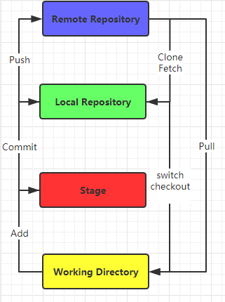

# Git 使用说明

## 安装Git
在Windows上安装Git，打开Git Bash，进行初步Global配置：
> $git config --global user.name "Your name"  
> $git config --global user.email "Your email"

## 创建Repository
创建并打开Repository所在的物理路径后，执行git init来创建空的repository。
> git init  

## 工作区、暂存区、本地版本库、远程版本库

- 工作区（Working Directory)
  本地的code change都在工作区
- 暂存区（Temporary Index)
  本地通过add提交的修改会保存在暂存区
- 本地版本库（Local Repository)
  commit提交的改动会更新到本地版本库。本地路径下有一个.git的folder，即为Stage暂存区，用来存放git repository的相关信息例如：版本信息、指针等。
- 远程版本库（Remote Repository)
  git push将本地版本库的改动提交至远程repository上，可以被其他人访问。

## 远程仓库
### 创建远程仓库，将本地仓库与之关联
在远程仓库平台（如GitHub等）创建repository后，可以用以下命令将本地repository与之关联： 
> $git remote add origin git@github.com:mattchuchuchu/gitskills.git  
下一步就是将本地repository种的所有内容推送到remote repository上去： 
> $git push -u origin master  
`Note: 第一次push的时候加上-u参数，git会将本地分支和远程分支关联起来，之后的推送/拉取就可以简化命令。` 
### 创建远程仓库，拉取远程code到本地
> $git clone git@github.com:mattchuchuchu/gitskills.git  
> cd gitskills

## 分支管理

## Tag管理
> $git tag v1.0  
> $git tag v1.0 <commit-id>  
> $git show tag v1.0

## Git 命令总结

| Command | Description | Examples |
| -------| ------- | ------- |
| git config | Initialize git configuration such as user.name/user.password. | git config --global user.name xxx |
| git init | Initialize empty repository | git init |
| git status | Check current status of local repository | |
| git diff | Check differences between current directory and local repository | git diff readme.txt (between working directory and stage)   git diff --HEAD readme.txt (between working directory and local repository) |
| git log | Check the change logs | git log --pretty=oneline --abbrev-commit   git log --graph --pretty=oneline --abbrev-commit|
| git reflog | Check all the submit logs| |
| -------| ------- | ------- |
| git branch | Check branches information | git branch - check local branches   git branch -r - check remote branches  git branch -d dev - delete dev branch git branch -D dev - force delete dev branch even if there are some unmerged changes. |
| git remote | Check the remote branch information | git remote -v with more details |
| git switch branch | Switch to a branch | git switch master  git switch -c develop = git checkout -b develop |
| git checkout -b branch | Create and switch to a new branch | git checkout -b develop  equals to   git branch develop + git checkout develop |
| git branch --set-upstream-to=origin/dev dev | set upstream connection between dev and origin/dev | |
| git merge branch | Merge branch to current branch | git merge devlop 使用fast-forward的方式合并分支，删除merge分支后分支提交信息会丢失。 git merge --no-ff -m "merge with no-ff" dev 使用no-ff的普通方式合并分支，会保留历史分支的提交信息。|
| -------| ------- | ------- |
| git add | Add file to temporary index | git add readme.txt |
| git commit | Submit file to local repository | git commit -m "add file" |
| git push | Push local repository changes to remote | git push origin master |
| git checkout -- file | Revert local changes to last commit/add status | git checkout -- readme.txt |
| git reset | Revert file to previous versions | git reset  `--hard HEAD^ - 上个版本` `--hard HEAD^^ - 上上个版本` `--hard HEAD~100 - 上100个版本` `--hard commit-id - 指定版本号` `HEAD <file> 撤销指定文件在暂存区的改动，重新放回工作区`|
| git rm file | Delete file | equals to "rm file and then git add file". | 
| -------| ------- | ------- |
| git stash | Temporarily save file changes in current branch | |
| git stash list | Get the stash list | |
| git stash pop | pop-up the stash | |
| git stash apply | apply the stash | git stash apply stash@{0}  use git stash drop to delete the stash |
| git cherry-pick <commit> | Copy a commit to current branch | |
| git rebase | Rebase your commits when merging with others' commits after pull remote branch | |
| git tag | tag your repository | git tag -a "tag name" -m "tag comments" <commit-id>   other operations: git tag -d v0.1 - 删除tag  git push origin v1.0 (--tags)  git tag -d <tagname> + git push origin :refs/tags/<tagname> 删除远程上的tag（先删本地，再删远程）|

git push --set-upstream origin common-improvement-1120-matt